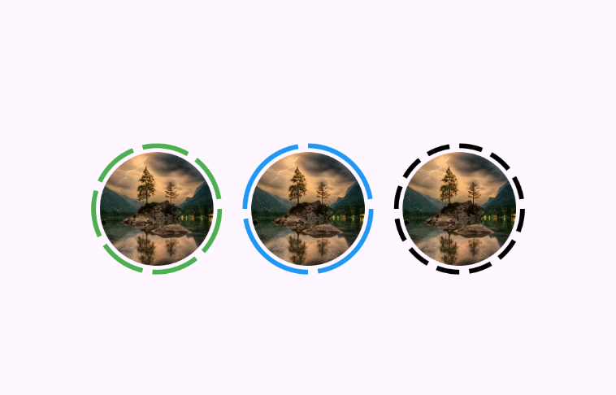

This package provides a customizable circular segment indicator around profile avatars. It allows full customization of the number of segments, stroke width, gap size, and image.




priview for new features:

https://github.com/user-attachments/assets/4d8bce4f-be0b-40a2-af47-8755fce8f52a


## Installation

Add this to your package's `pubspec.yaml` file:

```yaml
dependencies:
  story_segment_view: ^0.0.1
```

## Usage

```dart
StorySegmentView(
  imageUrl: 'url',
  color: Colors.black,
  segments: 12,
  radius: 40,
  strokeWidth: 3,
),
```

## All Parameters

| Parameter                           | Type                                             | Description |
|-------------------------------------|------------------------------------------------|-------------|
| `imageUrl`                          | `String`                                        | URL of the image. |
| `segments`                          | `int`                                          | Number of segments in the circular indicator. |
| `radius`                            | `double`                                       | Radius of the outer segment circle. |
| `strokeWidth`                       | `double`                                       | Thickness of each segment line. |
| `segmentGap`                        | `double`                                       | Gap between each segment in the indicator. |
| `color`                             | `Color`                                        | Color of the segments. |
| `placeholder`                       | `Widget Function(BuildContext, String)?`      | Widget displayed while the image is loading. |
| `errorWidget`                       | `Widget Function(BuildContext, String, Object)?` | Widget displayed if the image fails to load. |


